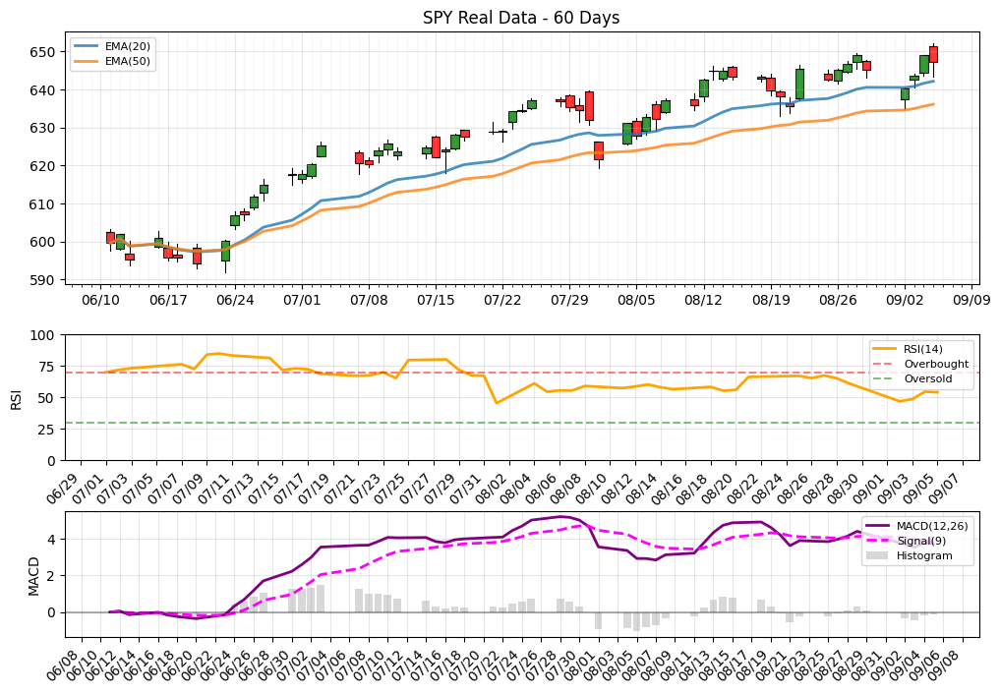

# Chart Markup Language

[](https://github.com/markdicksonjr/chart-markup-language/actions)

A domain-specific language for describing financial charts with bars, drawings, and technical indicators.

## Overview

The Chart Markup Language (CML) provides a human-readable and machine-parseable format for describing financial charts. It supports:

- **Metadata** - Chart information like title, author, and creation date
- **Price Bars** - OHLC (Open, High, Low, Close) data with timestamps
- **Drawings** - Various chart annotations including rectangles, lines, triangles, circles, and notes
- **Indicators** - Technical analysis indicators with configurable parameters
- **Styling** - Comprehensive styling options for colors, line styles, fonts, and opacity

## Grammar

The language is defined by an EBNF grammar specification. See `chart-markup-language.ebnf` for the complete grammar definition.

## Example

Here is a complete example demonstrating all features of the Chart Markup Language:

### Sample Output

The following chart was generated from the [SPY 60-day example CML file](examples/spy-60-days.cml) using the Python renderer:



**Source:** `examples/spy-60-days.cml` → **Output:** `examples/spy-60-days-example.png`

### Complete CML Example

```
meta:
    title: "EURUSD Session"
    author: "M D"
    description: "Example chart with bars, drawings, and indicators"
    created: "2025/06/09 09:30"

bars:
    2025/09/06 09:30, 1.0850, 1.0865, 1.0840, 1.0855
    2025/09/06 09:31, 1.0855, 1.0870, 1.0850, 1.0868
    2025/09/06 09:32, 1.0868, 1.0875, 1.0860, 1.0862
    2025/09/06 09:33, 1.0862, 1.0868, 1.0858, 1.0860

drawings:
    rectangle(2025/09/06 09:30,1.0870 ; 2025/09/06 09:33,1.0850)
        border-color=#FF0000
        fill-color=#FFAAAA
        line-width=2
        fill-opacity=0.3

    line(2025/09/06 09:30,1.0850 ; 2025/09/06 09:32,1.0875)
        arrow=arrow
        style=dashed
        border-color=#0000FF
        line-width=2
        line-opacity=0.8

    continuous-line(2025/09/06 09:31,1.0860 ; 2025/09/06 09:33,1.0858)
        style=solid
        border-color=#008000
        line-width=1

    uptick-triangle(2025/09/06 09:31)
        border-color=#008000
        fill-color=#00FF00

    downtick-triangle(2025/09/06 09:32)
        border-color=#800000
        fill-color=#FF0000

    undercircle(2025/09/06 09:30)
        border-color=#000000
        fill-color=#FFFF00
        fill-opacity=0.5

    overcircle(2025/09/06 09:33)
        border-color=#000000
        fill-color=#FF00FF
        line-width=1

    undernote(2025/09/06 09:31, "Support Zone")
        font-size=12
        font-color=#0000FF

    overnote(2025/09/06 09:32, "Resistance")
        font-size=12
        font-color=#FF0000

indicators:
    ema(period=20)
    ema(period=50)
    bollinger(period=20, stddev=2)
```

## Language Structure

A CML document consists of five optional sections:

### Meta Section
Chart metadata and descriptive information:
- `title` (string) - Main chart title
- `subtitle` (string) - Optional subtitle  
- `author` (string) - Chart creator
- `description` (string) - Chart description
- `created` (datetime) - Creation timestamp (format: `YYYY/MM/DD HH:MM`)

### Settings Section
Chart configuration and display options:
- `bar-type` - Chart bar style: `candlestick` (default), `heikin-ashi`, `ohlc`
- `y-axis-precision` - Y-axis decimal precision (number, default: 2)
- `bar-opacity` - Bar transparency (0.0-1.0, default: 1.0)
- `grid` - Grid configuration with indented properties:
  ```cml
  grid:
      enabled=true
      line-width=1
      color=#000000
      opacity=0.3
  ```

### Bars Section
OHLC price data in format: `datetime, open, high, low, close`

### Drawings Section
Technical analysis elements and annotations:

**Geometric Shapes:**
- `rectangle(start_time,start_price ; end_time,end_price)` - Rectangular areas
- `line(start_time,start_price ; end_time,end_price)` - Lines with optional arrows
- `continuous-line(start_time,start_price ; end_time,end_price)` - Lines extending to chart edges

**Markers:**
- `uptick-triangle(datetime)` - Upward triangles (below price)
- `downtick-triangle(datetime)` - Downward triangles (above price)
- `undercircle(datetime)` - Circles below price
- `overcircle(datetime)` - Circles above price

**Annotations:**
- `undernote(datetime, "text")` - Text notes below price
- `overnote(datetime, "text")` - Text notes above price

### Indicators Section
Technical analysis indicators:
- `ema(period=20)` - Exponential Moving Average
- `sma(period=20)` - Simple Moving Average
- `rsi(period=14)` - Relative Strength Index
- `macd(fast=12, slow=26, signal=9)` - MACD
- `bollinger(period=20, stddev=2)` - Bollinger Bands

## Styling

### Colors
Colors are specified in hex format:
- 3-digit: `#RGB` (e.g., `#FF0`)
- 6-digit: `#RRGGBB` (e.g., `#FF0000`)

### Line Styles
- `solid` - Solid lines
- `dashed` - Dashed lines
- `dotted` - Dotted lines

### Style Properties
All drawings support these style properties:
- `border-color` (hex color) - Border/line color
- `fill-color` (hex color) - Fill color
- `line-width` (number) - Line thickness
- `line-opacity` (0.0-1.0) - Line transparency
- `fill-opacity` (0.0-1.0) - Fill transparency
- `font-size` (number) - Text size (notes only)
- `font-color` (hex color) - Text color (notes only)
- `style` - Line style: `solid`, `dashed`, `dotted`
- `left-arrow` (boolean) - Show left arrow (lines only)
- `right-arrow` (boolean) - Show right arrow (lines only)

## Data Types

### DateTime Format
`YYYY/MM/DD HH:MM[:SS]`
- Example: `2025/01/15 10:30:15`

### Numbers
- Integers: `123`
- Decimals: `1.0850`

### Strings
- Quoted strings: `"Support Zone"`

## Usage

This language can be used to:
1. **Document trading strategies** - Describe chart patterns and analysis
2. **Share chart setups** - Exchange chart configurations between traders
3. **Automate chart generation** - Parse CML files to generate visual charts
4. **Backtest strategies** - Define historical chart conditions programmatically

## Implementations

### Go Renderer
A Go implementation with cross-platform binary builds available for every commit:

```bash
# Download the latest binary for your platform from GitHub Actions artifacts
./cml-renderer-<platform> input.cml output.png
```

Available platforms:
- Linux (amd64, arm64)
- Windows (amd64, arm64) 
- macOS (amd64, arm64)
- FreeBSD (amd64)
- OpenBSD (amd64)

**Note:** The Go renderer currently does not support subplots and therefore cannot render RSI and MACD indicators, which require separate Y-axis scales. Only price-scale indicators (EMA, SMA, Bollinger Bands) are supported.

### Python Renderer
A Python implementation using matplotlib:

```bash
cd python-renderer
pip install -r requirements.txt
python test_examples.py
```

## Development

### Building from Source

```bash
# Build Go renderer for current platform
make build-go

# Build Go renderer for all platforms
make build-go-all

# Test both renderers
make test-all
```

### CI/CD

Every commit automatically:
- Builds binaries for all supported platforms
- Tests both Go and Python renderers with all examples
- Provides downloadable artifacts in GitHub Actions

## Contributing

Contributions are welcome! Please feel free to submit a Pull Request. For major changes, please open an issue first to discuss what you would like to change.

## License

This project is licensed under the MIT License - see the [LICENSE](LICENSE) file for details.

## Files

- `chart-markup-language.ebnf` - Complete EBNF grammar specification
- `README.md` - This documentation file
- `examples/` - Sample CML files
- `go-renderer/` - Go implementation
- `python-renderer/` - Python implementation
- `LICENSE` - MIT License
- `CONTRIBUTING.md` - Contribution guidelines
- `CHANGELOG.md` - Version history